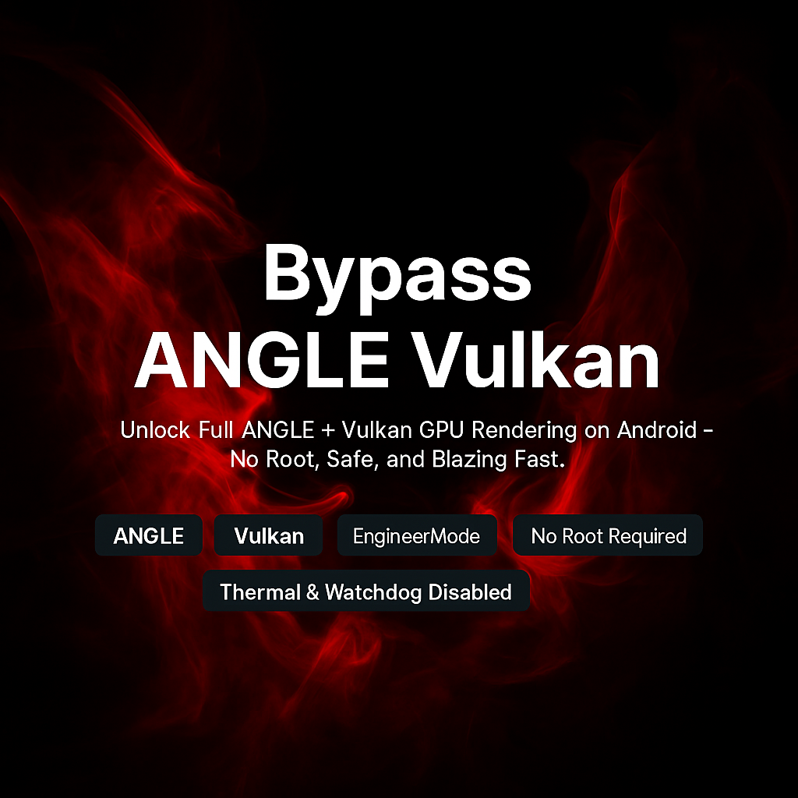

  <a href="README_ID.md">🇮🇩 Bahasa Indonesia</a> | <a href="README.md">🇬🇧 English</a>

  

<h1 align="center">Bypass ANGLE Vulkan</h1>

<b>Unlock Full ANGLE + Vulkan GPU Rendering on Android — No Root, Safe, and Blazing Fast</b>

  
  
  
  
  
  
  
   
  
  
  

---

## What is This?

> **Bypass ANGLE Vulkan** is a fully engineered system modification using `setprop` to unlock **Vulkan backend rendering** on low-end Android devices with ANGLE restrictions — **without root, bootloader unlock, or PC tools**.

Designed to unleash full GPU acceleration using a clean, native approach via **EngineerMode shell**, safely bypassing Android Go limitations.

---

## Tested Device

- **Realme C33**
  - Unisoc Tiger T612 (8-core)
  - Mali-G57 GPU
  - 2GB RAM + 2GB Extended
  - Android 13 Go Edition
  - *No root / No bootloader unlock / No ADB*

Confirmed working with:
- **Chrome Dev** — ANGLE Vulkan backend
- **Android System WebView** — Vulkan path active
- **System UI & HWUI** — GPU-accelerated rendering

---

## Features

- Unlock **ANGLE Vulkan** backend
- Force-enable **SkiaRenderer**, **HWUI GPU**, and GPU composition
- Accelerate **WebView** and **Chrome Dev** via Vulkan
- Disable **thermal throttling** & **watchdog timers**
- Inject advanced **Vulkan extensions (VK_KHR_*)**
- Clean, safe, **persistent system-level method** — no root needed

---

## How to Use

> You’ll need access to **EngineerMode Shell** — a native factory test shell on Realme / Unisoc devices.

### Steps:

1. Launch **EngineerMode Shell**  
   *(Search “EngineerMode” in Dialer or Settings — or use device-specific methods)*

2. Paste and run one of these scripts:

- [`Apply_Setprop_Script.sh`](Apply_Setprop_Script.sh)  
  *Full Vulkan unlock + Skia + thermal & watchdog override*

- [`Apply_Setprop_Script_Basic.sh`](Apply_Setprop_Script_Basic.sh)  
  *Lightweight version for stability and speed*

3. Reboot your device  
   You are now running with full ANGLE Vulkan GPU acceleration.

---

## Chrome Dev Flags (Maximize Performance)

To take full advantage of Vulkan in Chrome Dev, you must enable specific **flags**.  
Here’s the complete guide for best experience:

### How to Enable Flags:

1. Open **Chrome Dev**
2. Go to address bar, type:

chrome://flags

3. Use the search bar to find and **enable** the following:

| Flag | Recommended Setting |
|------|---------------------|
| `#enable-unsafe-webgpu` | Enabled |
| `#ignore-gpu-blocklist` | Enabled |
| `#use-vulkan` | Enabled |
| `#use-angle` | Vulkan |
| `#enable-zero-copy` | Enabled |
| `#enable-gpu-rasterization` | Enabled |
| `#enable-oop-rasterization` | Enabled |
| `#enable-skia-benchmarking` | Enabled |
| `#skia-graphite` | Enabled (if available) |
| `#smooth-scrolling` | Enabled ← **Don’t miss this!** |

4. After enabling all flags, tap **Relaunch** when Chrome prompts you.

---

## Verify: Is Vulkan Working?

After relaunching, go to:

chrome://gpu

Look for the following confirmations:

- **Graphics Backend**: Vulkan  
- **ANGLE Backend**: Vulkan  
- **Skia Renderer**: Vulkan  
- **Compositing**: GPU Accelerated  
- **Rasterization**: Hardware Accelerated  
- **Smooth Scrolling**: Enabled  

> If everything matches — congrats! Your system is now running with full GPU rendering powered by ANGLE + Vulkan.

---

## Behind the Scenes

This method is **rootless and clean**. It uses a **hidden-but-legit entrypoint**: EngineerMode Shell.

### EngineerMode Highlights:

- Available on many Realme / Unisoc devices  
- Runs `setprop` system calls in privileged mode  
- No root, no Magisk, no unlocked bootloader  
- Persists across reboots  
- Ideal for Android Go & locked devices  

### What's Happening Under the Hood

We optimize Android system behavior using low-level `persist.sys.*` properties such as:

- Forcing ANGLE to use the **Vulkan backend**
- Accelerating **HWUI**, **SkiaRenderer**, and **WebView rendering**
- Injecting support for advanced **Vulkan extensions** like `VK_KHR_*`
- Disabling **thermal throttling** and **watchdog timers**, giving full access to CPU & GPU under load
- Forcing **GPU composition**, zero-copy, and raster pipelines for ultra-smooth scrolling and rendering

> By disabling thermal and watchdog services, this setup ensures your device can deliver full performance without hidden system restrictions — especially important for sustained Vulkan rendering in Chrome/WebView.

This isn’t a hack — it’s a smart use of native debugging interfaces that already exist in your phone. We simply unlock what the device is capable of.

---

## Technical Highlights

These are the key technical mechanisms behind this project:

- **Vulkan backend override via `persist.sys.*`**  
  Forces ANGLE, WebView, and Skia to use Vulkan regardless of device class or GPU blocklist.

- **System-level GPU rendering enforcement**  
  Activates GPU composition, zero-copy rendering, and HWUI acceleration through clean system properties.

- **Thermal and watchdog bypass**  
  Disables kernel-level CPU/GPU throttling and watchdog resets using `persist.sys.thermal.*` and `persist.sys.watchdog.*` — stable under sustained GPU load.

- **Advanced Vulkan extension injection**  
  Injects Vulkan 1.1+ features like `VK_KHR_draw_indirect_count`, `VK_KHR_multiview`, `VK_EXT_subgroup_size_control`, etc., unlocking performance and compatibility on otherwise limited GPUs.

- **ANGLE multi-backend sync**  
  Enables dynamic fallback between OpenGL and Vulkan backends, useful for apps that partially support Vulkan.

- **100% persistent and stealth**  
  All changes survive reboots and remain hidden from UI, developer options, and standard debugging tools — yet fully active in the runtime system.

---

## Real-Time Sync Phenomenon

One of the most mind-blowing side effects of this `setprop` configuration is the spontaneous **real-time sync behavior** between:

- Internal storage (`/sdcard`)
- Termux working directory
- GitHub repository (via Git CLI in Termux)

Without any user-triggered action, `git status` begins detecting changes as soon as a file is created, modified, or moved on the device. Even newly captured screenshots instantly register in Termux — sometimes without requiring a `git add`.

**What makes this insane?**  
This occurs without:

- Root  
- ADB debugging  
- Bootloader unlock  
- Manual syncing tools (e.g. rsync or autosync apps)

The behavior is most likely the result of file I/O observation layers being fully unlocked due to GPU/IO-focused `setprop` combinations and thread priority boosts. This can turn Android’s file system layer into something close to an **event-driven realtime Git tracker**, especially when Termux is active.

---

# Bypass ANGLE Vulkan (No Root)

**[Watch Video Tutorial Here](https://youtu.be/_MLwruUpo30?si=f0vOu0P7hjiO6COD)**  
_A full guide to activate the script via ADB Shell inside EngineerMode without root._

---

## Preview

  

---

## License

Licensed under the [MIT License](LICENSE).  
Crafted for developers, tinkerers, and Android power users.
