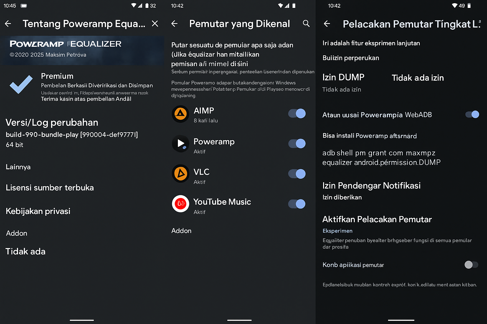

  <a href="README_ID.md">🇮🇩 Bahasa Indonesia</a> | <a href="README.md">🇬🇧 English</a>

  

<h1 align="center">Bypass ANGLE Vulkan</h1>

<b>Aktifkan Rendering Vulkan GPU Penuh di Android — Tanpa Root, Aman, dan Super Kencang</b>

  
  
  
  
  
  
  
  
  
   
  
  
  

---

## Apa Ini?

> **Bypass ANGLE Vulkan** adalah modifikasi sistem lengkap menggunakan `setprop` untuk membuka backend **rendering Vulkan** pada perangkat Android kelas bawah dengan batasan ANGLE — **tanpa root, tanpa unlock bootloader, tanpa alat PC**.

Dirancang untuk memaksimalkan akselerasi GPU sepenuhnya menggunakan pendekatan native dan aman melalui **EngineerMode shell**.

---

## Perangkat yang Diuji

- **Realme C33**
  - Unisoc Tiger T612 (8-core)
  - GPU Mali-G57
  - RAM 2GB + 2GB Extended
  - Android 13 Go Edition
  - *Tanpa root / bootloader tetap terkunci / tanpa ADB*

Dikonfirmasi bekerja pada:
- **Chrome Dev** — backend ANGLE Vulkan aktif
- **WebView Android System** — jalur Vulkan aktif
- **System UI & HWUI** — rendering akselerasi GPU aktif

---

## Fitur

- Buka backend **ANGLE Vulkan**
- Paksa aktifkan **SkiaRenderer**, **HWUI GPU**, dan komposisi GPU
- Akselerasi **WebView** dan **Chrome Dev** via Vulkan
- Nonaktifkan **thermal throttling** & **watchdog kernel**
- Suntikkan ekstensi **Vulkan lanjutan (VK_KHR_*)**
- Cara aman dan **persisten tingkat sistem** — tanpa root sama sekali

---

## Bonus: Poweramp Equalizer + AudioFX Vulkan

Skrip ini juga mencakup pengaturan tambahan untuk konfigurasi audio, guna menyinkronkan EQ secara real-time dan menghadirkan pemutaran audio dengan latensi sangat rendah.

### Fitur:
- **Poweramp Equalizer** dapat tersinkronisasi dengan semua aplikasi media tanpa memerlukan izin DUMP atau debugging ADB.
- Efek audio sistem (seperti Bass Boost, Reverb, dll.) berjalan mulus di seluruh sistem.
- Latensi audio yang sangat rendah — nyaris tanpa delay.
- Kompatibel dengan mode **AudioFX**, **Playback Capture**, dan **Deep Buffer**.
- Mendukung efek audio berbasis Vulkan untuk kejernihan dan pemrosesan spasial yang lebih baik.

Semua fitur ini diaktifkan secara otomatis melalui properti `persist.sys.*` dalam skrip `.sh`.  
Tidak perlu pengaturan manual — cukup jalankan skrip dan reboot perangkat.

### Screenshot: Sinkronisasi Poweramp Equalizer Tanpa Izin DUMP

Gambar di bawah ini menunjukkan bahwa **Poweramp Equalizer** berhasil mendeteksi dan tersinkronisasi dengan pemutar media pihak ketiga seperti **VLC**, **MX Player**, dan **AIMP**, *tanpa* memerlukan izin DUMP.

Hal ini sepenuhnya dimungkinkan berkat properti `persist.sys.*` terkait audio yang sudah termasuk dalam skrip `.sh`:

---

## Poweramp Equalizer (Opsional Tambahan)

Repositori ini juga menyertakan dukungan opsional untuk Poweramp Equalizer tanpa memerlukan izin DUMP atau akses root.

### Unduhan:

- [PoweRamp.apk](./PoweRamp/PoweRamp.apk) – Versi penuh Poweramp (opsional)
- [PoweRamp Equalizer.apk](./PoweRamp/PoweRamp%20Equalizer.apk) – Equalizer mandiri
- [PoweRamp+PresetEqualizer-Settings](./PoweRamp/PoweRamp+PresetEqualizer-Settings) – Konfigurasi preset (untuk aplikasi utama)
- [PoweRampEqualizer+PresetEqualizer-Settings](./PoweRamp/PoweRampEqualizer+PresetEqualizer-Settings) – Konfigurasi preset (untuk Equalizer mandiri)

> Cukup instal APK-nya dan tempatkan file pengaturan di penyimpanan internal.  
> Lalu, buka aplikasi Poweramp Equalizer dan impor preset melalui **Pengaturan > Equalizer > Impor**.

---

## Cara Pakai

> Kamu butuh akses ke **EngineerMode Shell** — terminal sistem asli di perangkat Realme / Unisoc.

### Langkah:

1. Buka **EngineerMode Shell**  
   *(Cari “EngineerMode” di Dialer atau Settings — atau pakai metode khusus tiap device)*

2. Paste dan jalankan salah satu skrip berikut:

- [`Apply_Setprop_Script.sh`](Apply_Setprop_Script.sh)  
  *Unlock Vulkan full + Skia + disable thermal & watchdog*

- [`Apply_Setprop_Script_Basic.sh`](Apply_Setprop_Script_Basic.sh)  
  *Versi ringan untuk kecepatan dan stabilitas*

3. Reboot perangkat  
   Kini sistem kamu aktif dengan rendering Vulkan GPU penuh.

---

## Unduhan Mirror (Google Drive)

Jika kamu lebih memilih unduhan langsung atau cadangan mirror, kamu bisa mengakses paket ZIP lengkap melalui Google Drive berikut:

**[Bypass-ANGLE-Vulkan (Paket ZIP) – Google Drive](https://drive.google.com/drive/folders/16E67hGsOTOWVwD9ABQa1OzUMIEb5ViMR)**

> Di dalamnya sudah termasuk semua skrip, file APK, dan konfigurasi preset dalam satu arsip praktis.

---

## Chrome Dev Flags (Tingkatkan Performa Maksimal)

Agar Vulkan berjalan maksimal di Chrome Dev, aktifkan flag berikut:

### Cara Aktifkan Flag:

1. Buka **Chrome Dev**
2. Ketik di address bar:

chrome://flags

3. Cari dan aktifkan yang berikut ini:

| Flag | Rekomendasi |
|------|-------------|
| `#enable-unsafe-webgpu` | Enabled |
| `#ignore-gpu-blocklist` | Enabled |
| `#use-vulkan` | Enabled |
| `#use-angle` | Vulkan |
| `#enable-zero-copy` | Enabled |
| `#enable-gpu-rasterization` | Enabled |
| `#enable-oop-rasterization` | Enabled |
| `#enable-skia-benchmarking` | Enabled |
| `#skia-graphite` | Enabled (jika ada) |
| `#smooth-scrolling` | Enabled ← **Wajib aktif!** |

4. Setelah semua aktif, klik **Relaunch**.

---

## Cek: Vulkan Aktif atau Tidak?

Buka:

chrome://gpu

Pastikan muncul:

- **Graphics Backend**: Vulkan  
- **ANGLE Backend**: Vulkan  
- **Skia Renderer**: Vulkan  
- **Compositing**: GPU Accelerated  
- **Rasterization**: Hardware Accelerated  
- **Smooth Scrolling**: Enabled  

> Kalau cocok semua — selamat! Vulkan aktif penuh.

---

## Di Balik Layar

Metode ini **tanpa root dan bersih**. Kita pakai entrypoint tersembunyi tapi legal: **EngineerMode Shell**.

### Kenapa EngineerMode?

- Tersedia di banyak HP Realme / Unisoc  
- Bisa jalanin `setprop` dengan hak istimewa  
- Tidak butuh root / Magisk / unlock  
- Efeknya **persisten walau reboot**  
- Cocok banget buat Android Go & HP terkunci

### Apa yang Terjadi di Sistem?

Dengan `persist.sys.*`, kita:

- Paksa ANGLE dan WebView pakai **Vulkan backend**
- Aktifkan **GPU composition**, **SkiaRenderer**, **HWUI**, dan zero-copy
- Suntikkan ekstensi Vulkan seperti `VK_KHR_*`
- Matikan **thermal throttling** dan **watchdog**
- Boost kinerja GPU + thread prioritas
- Singkronkan rendering antar backend OpenGL & Vulkan

> Sistem jadi jauh lebih responsif, scroll halus, dan rendering berat bisa ditangani bahkan di HP low-end.

---

## Fenomena Real-Time Sync

Efek paling gila dari konfigurasi ini: **sync real-time** antara:

- Penyimpanan internal (`/sdcard`)
- Folder Termux
- Repositori GitHub (via Git CLI Termux)

Tanpa kamu perintah, `git status` langsung deteksi perubahan file. Screenshot baru pun langsung kebaca, bahkan **tanpa ketik `git add`**!

**Kenapa ini gila?**  
Semua ini terjadi:

- Tanpa root  
- Tanpa ADB  
- Tanpa unlock bootloader  
- Tanpa autosync tools

Kemungkinan besar ini hasil efek kombinasi `setprop` yang membuka lapisan I/O + GPU thread observer sepenuhnya. Hasilnya mirip sistem **event-driven Git tracker realtime**, khususnya saat Termux aktif.

---

# Bypass ANGLE Vulkan (Tanpa Root)

**[Tonton Video Tutorial di Sini](https://youtu.be/chR2xlZGJ0w?si=LYbdYXEKkzrWKqoL)**  
_Panduan lengkap mengaktifkan skrip melalui ADB Shell di dalam EngineerMode tanpa root._

---

## Preview

  

---

> **Rilis Resmi di XDA Forums**  
> Proyek ini telah dipublikasikan secara resmi di XDA Developers:  
> [**Bypass ANGLE Vulkan – Full GPU Rendering untuk Android Go (Tanpa Root!)**](https://xdaforums.com/t/bypass-angle-vulkan.4731370/)

---

## Lisensi

Dilindungi oleh [MIT License](LICENSE).  
Dibuat untuk pengembang, modder, dan pengguna Android tingkat lanjut.
