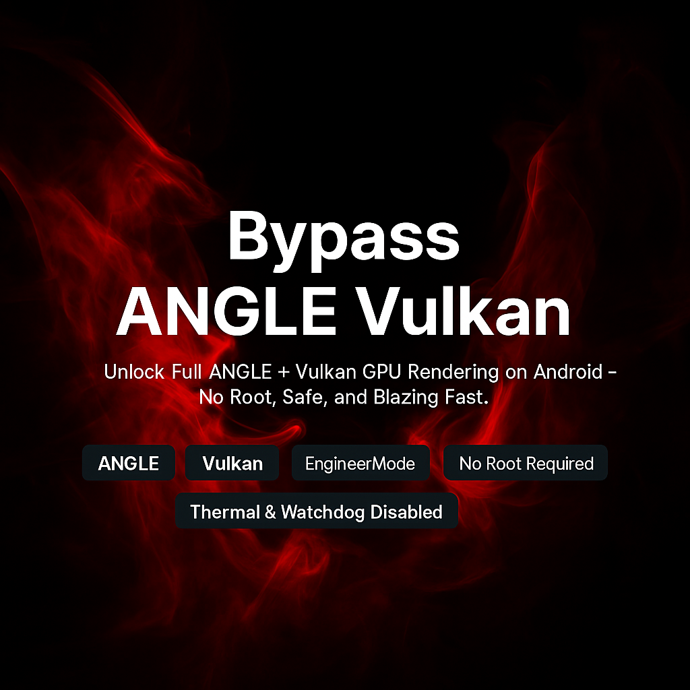

  <a href="README.md">🇬🇧 English</a> | <a href="README_ID.md">🇮🇩 Indonesia</a>

  

<h1 align="center">Bypass ANGLE Vulkan</h1>

<b>Mengaktifkan Rendering GPU ANGLE + Vulkan di Android — Tanpa Root</b>

  
  
  
  
  
  

---

## Apa Ini?

**Bypass ANGLE Vulkan** adalah pendekatan konfigurasi tingkat sistem menggunakan `setprop` untuk mengaktifkan backend rendering Vulkan pada perangkat Android yang mendukung, tanpa memerlukan akses root atau unlock bootloader.

Metode ini memanfaatkan shell EngineerMode bawaan perangkat untuk menerapkan properti sistem yang telah dioptimalkan guna meningkatkan akselerasi GPU.

---

## Perangkat yang Diuji

- Realme C33  
  - Unisoc Tiger T612  
  - GPU Mali-G57  
  - Android 13 Go Edition  
  - Tanpa root / bootloader tetap terkunci  

Dikonfirmasi berjalan pada:

- Chrome Dev (backend ANGLE Vulkan)
- Android System WebView
- System UI & HWUI dengan akselerasi GPU

---

## Fitur Utama

- Mengaktifkan backend ANGLE Vulkan.
- Meningkatkan akselerasi GPU pada komponen yang mendukung.
- Konfigurasi melalui ADB Shell di EngineerMode.
- Tidak memerlukan root.
- Pendekatan bersih dan dapat dikembalikan (reversible).

---

## Isi Proyek

- `Angle_Vulkan_Config_Setprop.txt`  
  Kumpulan konfigurasi `setprop` yang telah dioptimalkan.

- `script.sh`  
  Skrip ADB shell untuk menjalankan konfigurasi secara terstruktur.

- `README.html` / `index.html`  
  Pratinjau antarmuka kompatibel GitHub Pages.

- `Screenshot_Angle_Vulkan.png`  
  Screenshot demonstrasi aktivasi backend Vulkan.

---

## Pemberitahuan Penting

Proyek ini disediakan untuk tujuan edukasi dan penelitian.  
Pengguna bertanggung jawab atas risiko dan konsekuensi dari penerapan konfigurasi sistem pada perangkat masing-masing.

---

## Dukungan

Jika memiliki pertanyaan atau saran, silakan buka Issue pada repository ini.

---

## Lisensi

MIT License