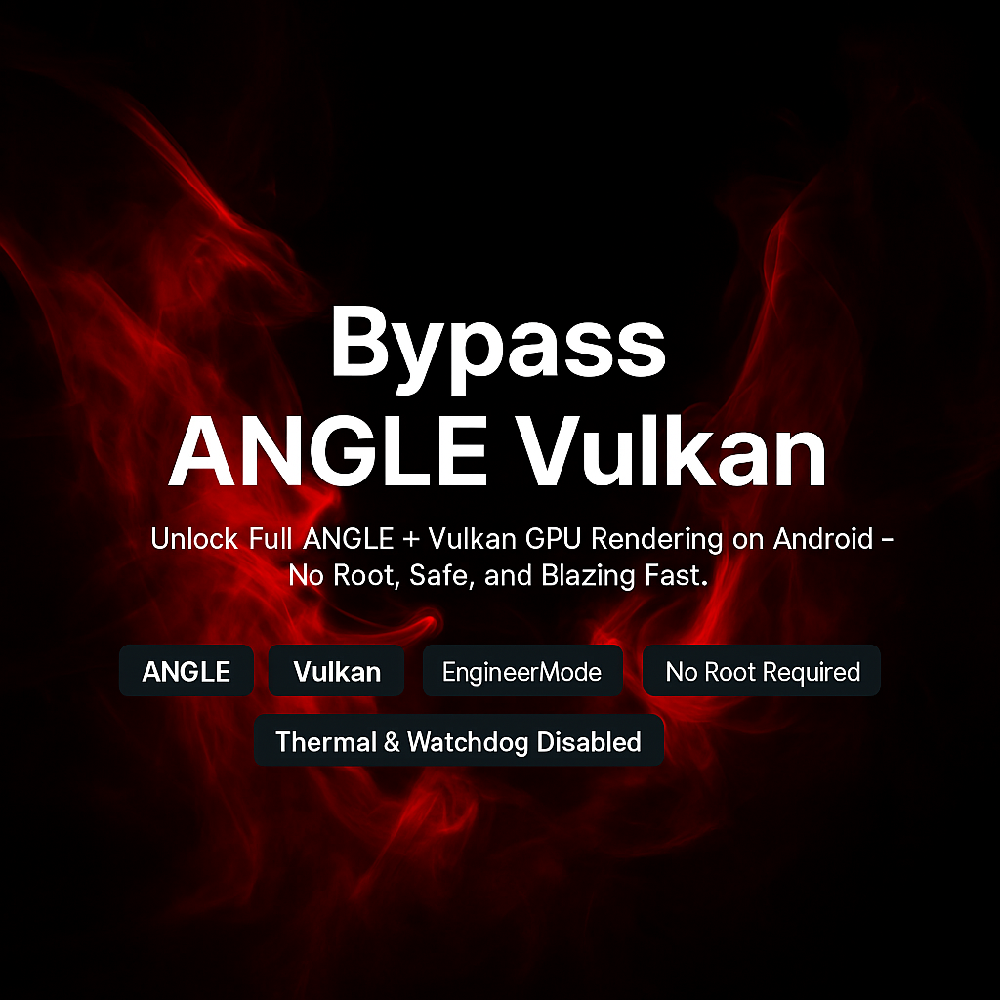

  

<h1 align="center">Bypass ANGLE Vulkan</h1>

<b>Aktifkan Rendering Vulkan GPU Full di Android — Tanpa Root, Aman, dan Ngebut</b>

---

## Apa Ini?

> **Bypass ANGLE Vulkan** adalah metode optimasi sistem Android menggunakan `setprop` untuk mengaktifkan **backend rendering Vulkan** di perangkat Android low-end yang dibatasi oleh ANGLE — **tanpa root, tanpa unlock bootloader, dan tanpa PC**.

Didesain untuk memaksimalkan akselerasi GPU menggunakan pendekatan native via **EngineerMode shell**, melewati batasan Android Go dengan aman dan stabil.

---

## Perangkat yang Diuji

- **Realme C33**
  - Unisoc Tiger T612 (8-core)
  - GPU Mali-G57
  - RAM 2GB + 2GB Extended
  - Android 13 Go Edition
  - *Tanpa root / Tanpa unlock bootloader / Tanpa ADB*

Dikonfirmasi berjalan di:
- **Chrome Dev** — Backend ANGLE Vulkan aktif
- **Android System WebView** — Vulkan aktif
- **System UI & HWUI** — Rendering berbasis GPU aktif

---

## Fitur

- Buka backend **ANGLE Vulkan**
- Paksa aktifkan **SkiaRenderer**, **HWUI GPU**, dan komposisi GPU
- Percepat **WebView** dan **Chrome Dev** via Vulkan
- Nonaktifkan **thermal throttling** & **watchdog**
- Suntikkan **Vulkan extensions (VK_KHR_*)**
- Metode native sistem-level yang **aman & permanen** — tanpa root

---

## Cara Pakai

> Yang dibutuhkan hanyalah akses ke **EngineerMode Shell** — terminal bawaan pabrik di perangkat Realme / Unisoc.

### Langkah:

1. Buka **EngineerMode Shell**  
   *(Cari “EngineerMode” lewat Dialer atau Setting — atau metode khusus perangkat)*

2. Jalankan salah satu dari dua script berikut:

- [`Apply_Setprop_Script.sh`](Apply_Setprop_Script.sh)  
  *Unlock Vulkan penuh + Skia + bypass thermal & watchdog*

- [`Apply_Setprop_Script_Basic.sh`](Apply_Setprop_Script_Basic.sh)  
  *Versi ringan, stabil & cepat*

3. Reboot perangkat  
   Sekarang perangkat lo udah jalan dengan akselerasi penuh Vulkan GPU.

---

## Chrome Dev Flags (Optimasi Tambahan)

Untuk manfaat penuh Vulkan di Chrome Dev, aktifkan beberapa **flags** di bawah ini:

1. Buka **Chrome Dev**
2. Masuk ke:

chrome://flags

3. Aktifkan flag berikut:

| Flag | Setelan |
|------|---------|
| `#enable-unsafe-webgpu` | Enabled |
| `#ignore-gpu-blocklist` | Enabled |
| `#use-vulkan` | Enabled |
| `#use-angle` | Vulkan |
| `#enable-zero-copy` | Enabled |
| `#enable-gpu-rasterization` | Enabled |
| `#enable-oop-rasterization` | Enabled |
| `#enable-skia-benchmarking` | Enabled |
| `#skia-graphite` | Enabled (jika tersedia) |
| `#smooth-scrolling` | Enabled ← **Jangan sampai kelewat!** |

4. Setelah diaktifkan, tap **Relaunch** saat diminta.

---

## Cek: Apakah Vulkan Sudah Aktif?

Buka:

chrome://gpu

Pastikan status ini muncul:

- **Graphics Backend**: Vulkan  
- **ANGLE Backend**: Vulkan  
- **Skia Renderer**: Vulkan  
- **Compositing**: GPU Accelerated  
- **Rasterization**: Hardware Accelerated  
- **Smooth Scrolling**: Enabled  

> Kalau semua aktif — selamat! Sistem lo udah berjalan dengan full rendering GPU lewat ANGLE + Vulkan.

---

## Di Balik Layar

Metode ini **tidak pakai root dan aman**. Menggunakan entrypoint asli dari sistem: **EngineerMode Shell**.

### Kenapa Ini Unik?

- Tersedia di banyak perangkat Realme / Unisoc  
- Bisa jalankan perintah `setprop` dengan hak istimewa  
- Tidak perlu root / Magisk / unlock bootloader  
- Tetap aktif walau reboot  
- Cocok untuk Android Go & perangkat yang terkunci

### Yang Terjadi Secara Internal

Properti `persist.sys.*` yang kita suntikkan berfungsi untuk:

- Memaksa ANGLE pakai backend **Vulkan**
- Mempercepat rendering via **HWUI**, **SkiaRenderer**, dan **WebView**
- Suntikkan dukungan **Vulkan extensions** seperti `VK_KHR_*`
- Nonaktifkan **thermal throttle** & **watchdog**, biar CPU & GPU bisa maksimal
- Paksa komposisi GPU + zero-copy + raster GPU = animasi & scroll super smooth

> Dengan thermal & watchdog dinonaktifkan, sistem bisa berjalan tanpa hambatan tersembunyi — ini penting banget buat Vulkan rendering yang butuh konsistensi.

Ini bukan hack — ini eksploitasi **fitur debug resmi** yang ada di sistem lo. Kita cuma unlock potensi penuh yang dikunci pabrikan.

---

## Fenomena Sinkronisasi Real-Time

Efek samping yang paling mengejutkan dari konfigurasi `setprop` ini adalah munculnya **sinkronisasi real-time otomatis** antara:

- Penyimpanan internal (`/sdcard`)
- Folder kerja Termux
- Repo GitHub (via Git CLI di Termux)

Tanpa perlu `git add`, `git commit`, atau alat sync apapun, file yang lo simpan atau ubah langsung terdeteksi oleh `git status` seketika — bahkan screenshot baru langsung kebaca.

**Dan ini semua terjadi tanpa:**

- Root
- ADB debugging
- Unlock bootloader
- Alat sync manual (rsync/autosync)

Kemungkinan besar disebabkan oleh efek gabungan `setprop` yang mengoptimalkan I/O + GPU thread, bikin Android lo kayak punya **tracker Git real-time** bawaan.

---

## Tampilan Repo Ini = Bukti Nyata

Seluruh tampilan, screenshot, dan video demo yang ada di repositori ini **dibuat langsung dari HP Android tanpa root, tanpa akses debugging, dan tanpa PC**.

> Semua efek visual seperti:
> - **Transisi halus antar halaman**
> - **Scroll yang mulus tanpa stutter**
> - **Pencahayaan & efek blur halus di UI**
> - **Rendering halaman GitHub & animasi markdown**

...semuanya ditampilkan secara **native oleh GPU Vulkan** melalui metode bypass ini.

Artinya:
- Tidak ada akses root
- Tidak ada adb debugging
- Tidak ada bantuan desktop
- Tidak ada perekaman screen pakai eksternal

Hanya murni dari optimasi `setprop` sistem dan aktivasi backend **ANGLE Vulkan**.

**Jadi kalau lo lihat halaman ini tampil halus di device lo — itu karena Vulkan jalan.**

---

## Video Demo

Tonton demo langsung di sini:  
[https://gofile.io/d/fQt9yh](https://gofile.io/d/fQt9yh)

---

## Pratinjau

  

---

## Lisensi

Lisensi di bawah [MIT License](LICENSE).  
Dibuat untuk pengembang, pengguna tingkat lanjut, dan pejuang Android sejati.
